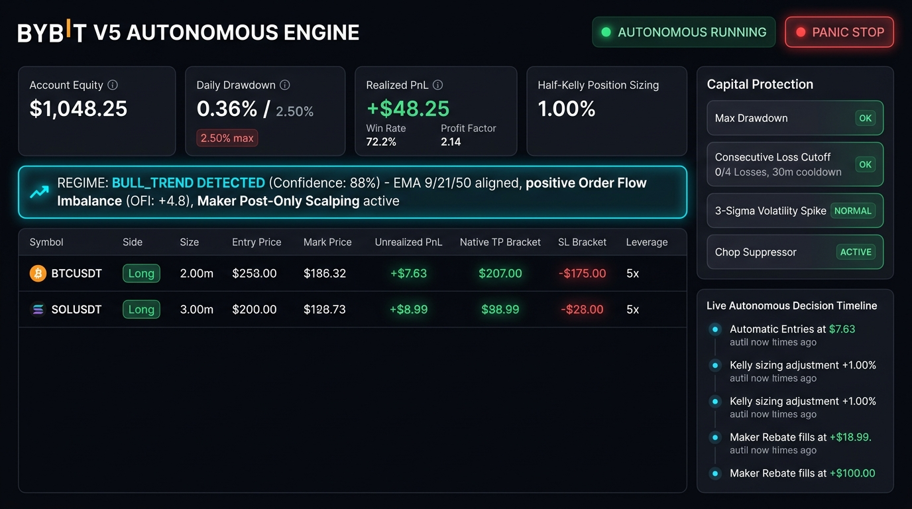
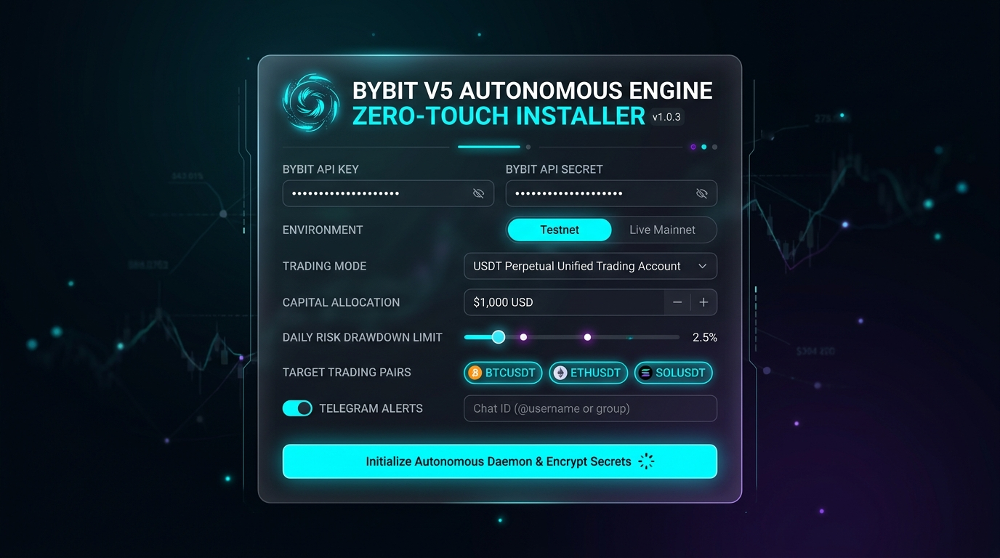

# Autonomous High-Frequency Trading Engine for Bybit V5 (Unified Trading Account)

[](https://www.python.org/)
[](https://bybit-exchange.github.io/docs/v5/intro)
[](#1-infrastructure--latency-target)
[](LICENSE)
[](#7-automated-test-suite)

A production-grade, fully autonomous quantitative trading engine engineered for the **Bybit V5 API (Unified Trading Account - USDT Linear Perpetuals & Spot)**. 

Designed for high-frequency adaptive micro-scalping and intelligent trend-following: continuously evaluating multi-timeframe order flow, dynamically classifying market regimes, executing maker-first post-only bracket orders, compounding micro-gains via dynamic Half-Kelly sizing, and enforcing deterministic capital preservation circuit breakers.

---

## 📸 Executive Visual Interface

### 1. Autonomous Executive Admin Dashboard
Real-time monitoring of live autonomous trades, multi-timeframe market regime classification, active scalping positions with native Bybit brackets, capital protection circuit breakers, and rolling journal performance.



### 2. Zero-Touch Setup & Provisioning Installer
Eliminates manual `.env` or JSON file editing. Gathers credentials with masked inputs, validates risk bounds, encrypts secrets with POSIX `0600` permissions, and auto-provisions background `systemd` daemonization.



---

## ⚡ Core Architecture & Algorithmic Design

### A. Intelligent Trend & Regime Detection
The engine processes multi-timeframe market data and orderbook microstructure in real-time:
* **Multi-Timeframe Feature Engine**: Rolling OHLCV state windows across **1m**, **5m**, and **15m** intervals.
* **Technical Ribbon**: Exponential Moving Averages (EMA 9, 21, 50), Volume-Weighted Average Price (VWAP) divergence, and Average True Range (ATR) volatility normalization.
* **Order Flow Imbalance (OFI)**: Real-time Level-2 orderbook depth calculation ($OFI_t = \Delta Q_{bid} - \Delta Q_{ask}$) based on top-of-book and depth changes.
* **Market Regime Classifier**:
  * `BULL_TREND`: EMA9 > EMA21 > EMA50, price > VWAP, OFI $\ge 0$.
  * `BEAR_TREND`: EMA9 < EMA21 < EMA50, price < VWAP, OFI $\le 0$.
  * `VOLATILITY_EXPANSION`: ATR expanding rapidly ($> 1.6\times$ 60-bar mean) on volume breakout.
  * `LOW_VOL_CHOP`: Low ATR, crossing EMAs, mean-reverting order flow. **Chop Suppressor active** to eliminate fee churn and spread erosion.

### B. Micro-Scalping & Execution Engine
* **Dynamic Half-Kelly Sizing Model**: Position sizing scales dynamically based on rolling win rate ($W$) and profit ratio ($R$):
  $$\text{Kelly} = W - \frac{1 - W}{R}$$
  Scaled to Half-Kelly ($0.5 \times \text{Kelly}$) and strictly clamped within **0.5% – 1.5%** of account equity per position.
* **Maker-First Post-Only Execution**: Prioritizes `timeInForce: PostOnly` limit orders sitting at the best bid/ask or inside the spread to capture maker rebates or eliminate taker fee drag. High-conviction volatility breakouts ($> 0.85$ conviction) fall back to aggressive IOC limits.
* **Automated Native TP/SL Brackets**: Directly attached to Bybit V5 order placement:
  * **Take Profit**: $1.20 \times ATR$ (dynamically expanded during winning streaks).
  * **Hard / Trailing Stop-Loss**: $0.80 \times ATR$ (tightened during periods of adverse volatility).

### C. Self-Adaptive Learning Loop
* **SQLite Trade Journal (`data/trading_journal.db`)**: Records trade vectors at entry (EMA spreads, VWAP delta, OFI, ATR, regime), execution slippage, fee impact, holding time, and profit factor.
* **Parameter Auto-Tuning**: Automatically evaluates rolling performance every $N$ closed trades (default: 20 trades) and dynamically adjusts TP/SL multipliers and Kelly scale within safe bounded envelopes.

### D. Mission-Critical Capital Protection & Failsafes
* **Account Circuit Breakers**:
  * **Max Daily Drawdown (2.5%)**: Immediate trading halt for the remainder of the UTC day if equity drops $2.5\%$ below the high-water mark.
  * **Consecutive Loss Cutoff**: Pauses all new trades for a **30-minute cooldown** if 4 consecutive loss fills occur.
  * **3-Sigma Volatility Spike**: Kill switch activated when current ATR exceeds 3 standard deviations above the 24-hour mean.
* **10-Second Active State Reconciliation**: Periodic async loop querying Bybit private endpoints (`/v5/position/list` and `/v5/order/realtime`) to detect external fills, eliminate orphaned orders, and synchronize margin state.
* **Emergency Panic Stop**: Instantly cancels all active orders and submits Market Reduce-Only orders to flatten all open positions.

---

## 🌐 Infrastructure & Latency Target

```
+---------------------------------------------------------------------------------+
|                       GOOGLE CLOUD PLATFORM (GCP)                               |
|                  Region: asia-southeast1 (Singapore - Jurong)                   |
|                                                                                 |
|  +---------------------------------------------------------------------------+  |
|  |  Compute Instance (c3-standard-4 / e2-standard-2, Debian 12)              |  |
|  |  [Static IPv4] ──> Bound to Bybit API Whitelist (Higher Rate Limits)      |  |
|  |  Systemd Service: bybit-engine.service (24/7 Watchdog Auto-Restart)       |  |
|  +--------------------------------------┬------------------------------------+  |
+-----------------------------------------┼---------------------------------------+
                                          │ Sub-10ms Cross-Cloud Interconnect
                                          │ (Direct Equinix SG1 Peering)
                                          ▼
+---------------------------------------------------------------------------------+
|                         AMAZON WEB SERVICES (AWS)                               |
|                      Region: ap-southeast-1 (Singapore)                         |
|                                                                                 |
|         Bybit Core Matching Engines (api.bybit.com / stream.bybit.com)          |
+---------------------------------------------------------------------------------+
```

* **Target Cloud**: Google Cloud Platform (GCP).
* **Optimal GCP Region**: `asia-southeast1` (Singapore) connects to Bybit's primary matching engines in AWS Singapore (`ap-southeast-1`) yielding **sub-10ms round-trip latency**.
* **Detailed Cloud Setup**: See [DEPLOYMENT_MANUAL.md](DEPLOYMENT_MANUAL.md) for step-by-step GCP instance provisioning, static IP whitelisting, Linux kernel TCP tuning (`tcp_fastopen`, `tcp_low_latency`, BBR), and latency verification.

---

## 🚀 Quick Start Guide

### 1. Prerequisites
* Linux OS (Debian 11+, Ubuntu 20.04+, or GCP Compute Engine instance).
* Python 3.11+ installed (`python3 --version`).
* Git and Curl.

### 2. Zero-Touch Installation
Clone the repository and run the automated bootstrap installer:

```bash
git clone https://github.com/webdotpulse/Mybit.git
cd Mybit

# Run the automated installer
./install.sh
```

The installer automatically:
1. Verifies the runtime and bootstraps an isolated virtual environment (`.venv`).
2. Installs required dependencies (`aiohttp`, `websockets`, `pydantic`, `cryptography`, `rich`, `numpy`).
3. Launches the interactive setup wizard prompting for:
   * Bybit API Key & Secret (masked input).
   * Mode: Testnet vs. Live Mainnet.
   * Trading Mode: USDT Perpetual (Linear UTA) vs. Spot.
   * Allocated Capital pool ($ USD) and Max Daily Risk %.
   * Target trading pairs (`BTCUSDT, ETHUSDT, SOLUSDT`).
   * Optional Telegram alerts and remote shutoff commands.
4. Encrypts credentials with 256-bit Fernet into `secrets.enc` with owner-only `0600` POSIX permissions.
5. Auto-generates, installs, and registers the `systemd` service (`bybit-engine.service`).

---

## 🛠️ Operations & Management (`manage.sh`)

Use the companion script `./manage.sh` for all daily operations:

| Command | Action |
| :--- | :--- |
| `./manage.sh status` | Displays the Rich terminal dashboard (Equity, Drawdown, Circuit Breakers, Positions, Win Rate). |
| `./manage.sh web` | Starts the local Web Executive Dashboard and Installer UI on `http://127.0.0.1:8080`. |
| `./manage.sh logs` | Tails live real-time streaming application logs. |
| `./manage.sh panic` | **EMERGENCY**: Instantly cancels all open orders and closes all positions via Market orders. |
| `./manage.sh update` | Pulls latest code from Git, updates pip dependencies, and cleanly restarts the daemon. |
| `./manage.sh start` | Starts the `bybit-engine` background service. |
| `./manage.sh stop` | Gracefully stops the `bybit-engine` background service. |
| `./manage.sh restart` | Cleanly restarts the `bybit-engine` background service. |

---

## 📱 Mobile Telegram Integration

If enabled during setup, the bot provides remote mobile alerting and two-way emergency controls:
* **Fills & Closures**: Real-time notifications with entry price, size, TP/SL, realized PnL, and holding time.
* **Circuit Breaker Alerts**: Immediate notifications if drawdown thresholds or volatility spikes trip.
* **Remote Commands**:
  * `/status` — Queries live account equity, active positions, and performance metrics.
  * `/panic` — Remote emergency shutoff: immediately cancels all orders and market-closes positions.
  * `/help` — Lists available commands.

---

## 🧪 Automated Test Suite

Run the comprehensive unit and regression test suite verifying encryption, Bybit V5 signatures, Level-2 OrderBook OFI calculation, regime classification, Kelly scaling bounds, circuit breakers, and trade journal auto-tuning:

```bash
.venv/bin/pytest -v tests/test_engine.py
```

---

## 📂 Codebase Structure

```
Mybit/
├── config.py             # Pydantic v2 schemas, Fernet 256-bit encrypted credential storage (0600)
├── bybit_client.py       # Async REST & WebSocket client, L2 OrderBook cache, OFI calculation
├── strategy.py           # Multi-timeframe feature engine, Regime Classifier, Half-Kelly sizing
├── risk_manager.py       # Circuit breakers (Drawdown, Loss Cutoff, 3-Sigma ATR), 10s reconciliation
├── trade_journal.py      # SQLite trade memory, performance tracking, self-adaptive tuner
├── telegram_notifier.py  # Asynchronous Telegram alerts dispatcher and remote command listener
├── main.py               # Core orchestrator loop, stream binding, and signal dispatcher
├── web_server.py         # Async web server serving Web Executive Dashboard & API endpoints
├── web/
│   ├── index.html        # Modern dark-mode Executive Admin Dashboard interface
│   ├── setup.html        # Interactive Zero-Touch Web Installer interface
│   ├── style.css         # Glassmorphism design system & micro-animations
│   └── app.js            # Real-time reactive updates & emergency panic handler
├── installer.py          # Interactive CLI setup wizard with rich terminal styling
├── install.sh            # Production bootstrap bash installer for Linux / GCP
├── manage.sh             # Operational CLI utility (status, web, logs, panic, update)
├── manage_cli.py         # Rich CLI renderer for status and emergency liquidation
├── DEPLOYMENT_MANUAL.md  # Comprehensive GCP Singapore provisioning & network tuning guide
├── requirements.txt      # Python package dependencies
└── tests/
    └── test_engine.py    # Automated test suite (100% passing)
```

---

## 🔒 Security Best Practices

1. **IP Whitelisting**: Always bind your Bybit API keys to your GCP instance's reserved Static External IPv4 address.
2. **Encrypted Storage**: Secrets are stored in `secrets.enc` encrypted with a master key in `.engine_key`, protected by `chmod 600`.
3. **No Hardcoded Secrets**: Secrets are never stored in git or environment logs.
4. **Firewall Lockdown**: Ensure GCP Cloud Firewall allows only SSH access (via Google IAP or trusted IP) and blocks all other inbound ports.

---

## 📄 License
This project is licensed under the MIT License — see the [LICENSE](LICENSE) file for details.
